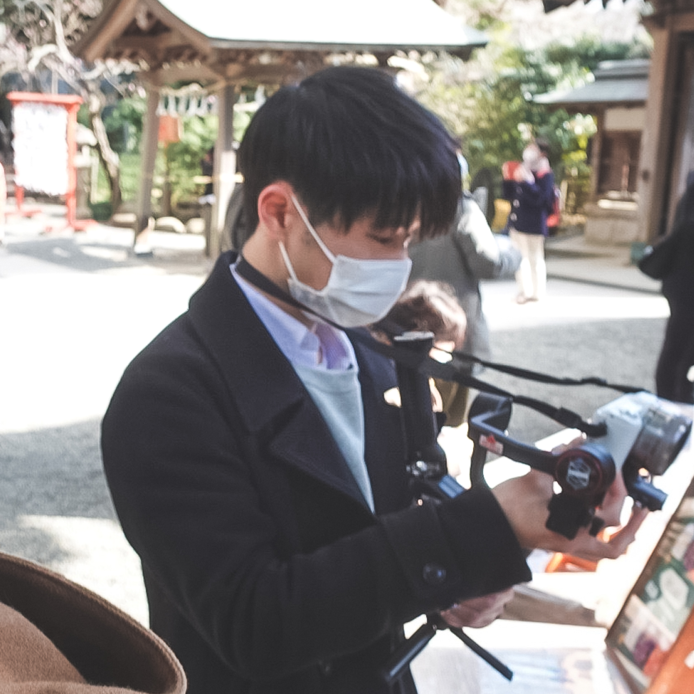

## Hello there 👋

* 🎈  Vimmer & Gopher 
* 🌱  Currently learning Next.js.
* 👀  Interested in mobile development with Flutter.   
* 🎓  Majoring in Computer Science at YNU.

### Languages: 

  
  
  
  
  
  
   
  
   

  
 

### Technologies & Tools: 

  
  
  
  
  
  
  

 

### Current works:
* [ucf2022](https://github.com/kurikin/ucf2022) : Official website of school festival. (https://ucf2022.com)
   
  
  
  ![Microcms](https://img.shields.io/badge/MicroCMS-34485a.svg?style=flat-square&logo=data:image/svg+xml;base64,PD94bWwgdmVyc2lvbj0iMS4wIiBlbmNvZGluZz0iVVRGLTgiPz4KPHN2ZyB3aWR0aD0iODBweCIgaGVpZ2h0PSI4MHB4IiB2aWV3Qm94PSIwIDAgODAgODAiIHZlcnNpb249IjEuMSIgeG1sbnM9Imh0dHA6Ly93d3cudzMub3JnLzIwMDAvc3ZnIiB4bWxuczp4bGluaz0iaHR0cDovL3d3dy53My5vcmcvMTk5OS94bGluayI+CiAgICA8ZyBpZD0iTG9nbyIgc3Ryb2tlPSJub25lIiBzdHJva2Utd2lkdGg9IjEiIGZpbGw9Im5vbmUiIGZpbGwtcnVsZT0iZXZlbm9kZCI+CiAgICAgICAgPGcgaWQ9IkFydGJvYXJkIiB0cmFuc2Zvcm09InRyYW5zbGF0ZSgtNzAuMDAwMDAwLCAtODAuMDAwMDAwKSIgZmlsbD0id2hpdGUiPgogICAgICAgICAgICA8ZyBpZD0iR3JvdXAtMiIgdHJhbnNmb3JtPSJ0cmFuc2xhdGUoNzAuMDAwMDAwLCA4MC4wMDAwMDApIj4KICAgICAgICAgICAgICAgIDxnIGlkPSJHcm91cCI+CiAgICAgICAgICAgICAgICAgICAgPHBhdGggZD0iTTcwLDUuNjg0MzQxODllLTE0IEM3NS41MjI4NDc1LDUuNjg0MzQxODllLTE0IDgwLDQuNDc3MTUyNSA4MCwxMCBMODAsNzAgQzgwLDc1LjUyMjg0NzUgNzUuNTIyODQ3NSw4MCA3MCw4MCBMMTAsODAgQzQuNDc3MTUyNSw4MCAtNy4xMDU0MjczNmUtMTQsNzUuNTIyODQ3NSAtNy4xMDU0MjczNmUtMTQsNzAgTC03LjEwNTQyNzM2ZS0xNCwxMCBMLTcuMTA1NDI3MzZlLTE0LDEwIEMtNy4xMDU0MjczNmUtMTQsNSA1LDUuNjg0MzQxODllLTE0IDEwLDUuNjg0MzQxODllLTE0IEw3MCw1LjY4NDM0MTg5ZS0xNCBMNzAsNS42ODQzNDE4OWUtMTQgWiBNNjQuNzQ4NzM3MywzNi40NjQ0NjYxIEM2Mi43OTYxMTU5LDM0LjUxMTg0NDYgNTkuNjMwMjkxLDM0LjUxMTg0NDYgNTcuNjc3NjY5NSwzNi40NjQ0NjYxIEw1Ny42Nzc2Njk1LDM2LjQ2NDQ2NjEgTDM4LjU4NTc4NjQsNTUuNTU2MzQ5MiBMMzUuNzU3MzU5Myw1Mi43Mjc5MjIxIEwzMC4xMDA1MDUxLDU4LjM4NDc3NjMgTDM1LjA1MDI1MjUsNjMuMzM0NTIzOCBDMzcuMDAyODc0LDY1LjI4NzE0NTIgNDAuMTY4Njk4OSw2NS4yODcxNDUyIDQyLjEyMTMyMDMsNjMuMzM0NTIzOCBMNDIuMTIxMzIwMyw2My4zMzQ1MjM4IEw2MS4yMTMyMDM0LDQ0LjI0MjY0MDcgTDY0LjA0MTYzMDYsNDcuMDcxMDY3OCBMNjkuNjk4NDg0OCw0MS40MTQyMTM2IFogTTUzLjQzNTAyODgsMjUuMTUwNzU3NiBDNTEuNDgyNDA3NCwyMy4xOTgxMzYxIDQ4LjMxNjU4MjUsMjMuMTk4MTM2MSA0Ni4zNjM5NjEsMjUuMTUwNzU3NiBMNDYuMzYzOTYxLDI1LjE1MDc1NzYgTDIxLjYxNTIyMzcsNDkuODk5NDk0OSBMMjcuMjcyMDc3OSw1NS41NTYzNDkyIEw0OS44OTk0OTQ5LDMyLjkyODkzMjIgTDUyLjcyNzkyMjEsMzUuNzU3MzU5MyBMNTguMzg0Nzc2MywzMC4xMDA1MDUxIFogTTQyLjEyMTMyMDMsMTMuODM3MDQ5MSBDNDAuMTY4Njk4OSwxMS44ODQ0Mjc2IDM3LjAwMjg3NCwxMS44ODQ0Mjc2IDM1LjA1MDI1MjUsMTMuODM3MDQ5MSBMMzUuMDUwMjUyNSwxMy44MzcwNDkxIEwxMy44MzcwNDkxLDM1LjA1MDI1MjUgQzExLjg4NDQyNzYsMzcuMDAyODc0IDExLjg4NDQyNzYsNDAuMTY4Njk4OSAxMy44MzcwNDkxLDQyLjEyMTMyMDMgTDEzLjgzNzA0OTEsNDIuMTIxMzIwMyBMMTguNzg2Nzk2Niw0Ny4wNzEwNjc4IEwyNC40NDM2NTA4LDQxLjQxNDIxMzYgTDIxLjYxNTIyMzcsMzguNTg1Nzg2NCBMMzguNTg1Nzg2NCwyMS42MTUyMjM3IEw0MS40MTQyMTM2LDI0LjQ0MzY1MDggTDQ3LjA3MTA2NzgsMTguNzg2Nzk2NiBaIiBpZD0iQ29tYmluZWQtU2hhcGUiPjwvcGF0aD4KICAgICAgICAgICAgICAgIDwvZz4KICAgICAgICAgICAgPC9nPgogICAgICAgIDwvZz4KICAgIDwvZz4KPC9zdmc+Cg==&logoColor=white)
  
  
* [jcba-prototype](https://github.com/kurikin/jcba-prototype) : JCBA (Japan Cap Baseball Association) offcial app.
   
  
  
  
* [image-to-pdf-linebot](https://github.com/kurikin/image-to-pdf-linebot) : LINE Bot to automate conversion from image to pdf.
   
  
  
  
  
  
  
* [reversi](https://github.com/kurikin/reversi) : Online reversi game in collaboration with [OhVIton](https://github.com/OhVIton).
   
  
  
  
  
  
